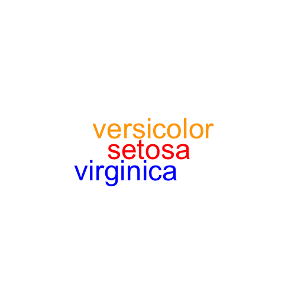

## Modelwordcloud

**Modelwordcloud** is a package that makes a word cloud out of text, primarially based on the associations between that text and a predictive model.


```r
data(iris)
model <- lm(Petal.Width ~ Species, iris)
summary(model)
```

```
## 
## Call:
## lm(formula = Petal.Width ~ Species, data = iris)
## 
## Residuals:
##    Min     1Q Median     3Q    Max 
## -0.626 -0.126 -0.026  0.154  0.474 
## 
## Coefficients:
##                   Estimate Std. Error t value Pr(>|t|)    
## (Intercept)        0.24600    0.02894    8.50 1.96e-14 ***
## Speciesversicolor  1.08000    0.04093   26.39  < 2e-16 ***
## Speciesvirginica   1.78000    0.04093   43.49  < 2e-16 ***
## ---
## Signif. codes:  0 '***' 0.001 '**' 0.01 '*' 0.05 '.' 0.1 ' ' 1
## 
## Residual standard error: 0.2047 on 147 degrees of freedom
## Multiple R-squared:  0.9289,	Adjusted R-squared:  0.9279 
## F-statistic:   960 on 2 and 147 DF,  p-value: < 2.2e-16
```

As we can see, setosa (represented by the intercept) is the least associated with Petal.Width, wheras virginica is the most associated.

We can show this in a word cloud:


```r
words_and_freqs <- rle(as.character(iris$Species))
freqs <- words_and_freqs$lengths
words <- words_and_freqs$values
coefficients <- model$coefficients
colors <- c("red", "orange", "blue")  # Least associated gets red, most associated gets blue.
library(modelwordcloud)
wordcloud(words = words, freq = freqs, coefficients = coefficients, colors = colors)
```



